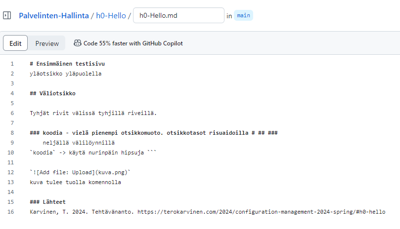

# Ensimmäinen testisivu - # alkuun
yläotsikko yläpuolella

## Väliotsikko - ## alkuun

Tyhjät rivit välissä tyhjillä riveillä.

### koodia - ### alkuun
    neljällä välilöynnillä tulee koodi näkyviin
`koodia` -> käytä nurinpäin hipsuja ```

``

kuva tulee tuolla komennolla, korvataan kuva.png sivustolle ladatun kuvan nimellä

- luettelomerkit
- tulevat
- ranskalaisella viivalla `-` rivin alussa

### Lähteet
Karvinen, T. 2024. Tehtävänanto. https://terokarvinen.com/2024/configuration-management-2024-spring/#h0-hello
