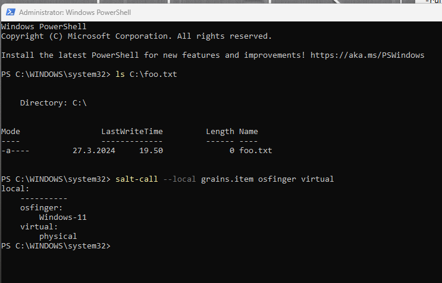
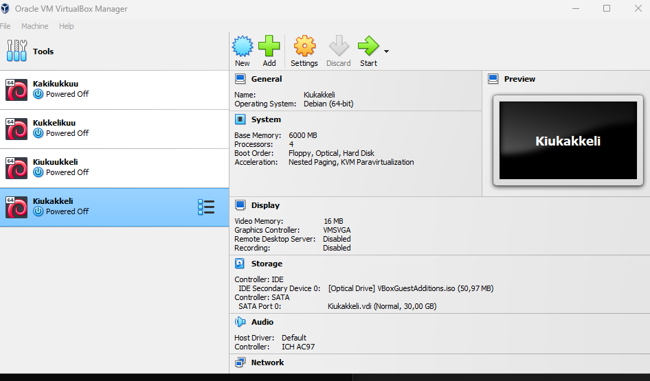
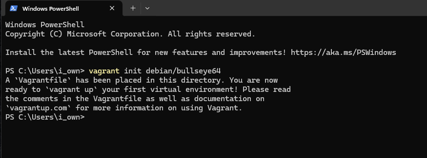
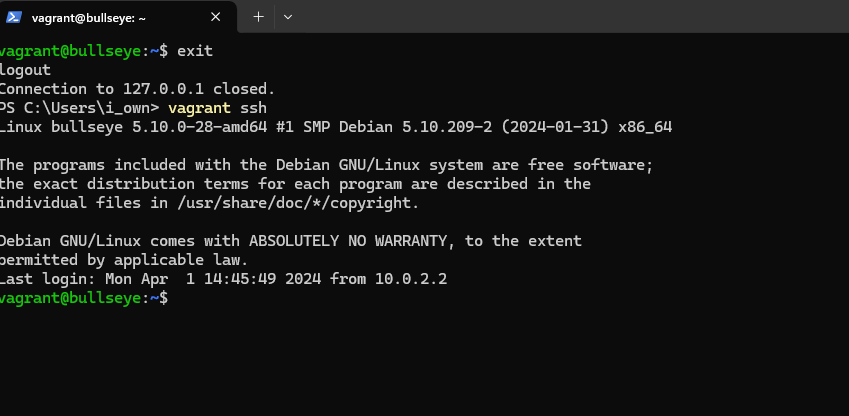
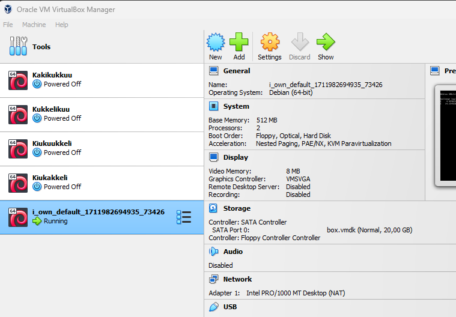
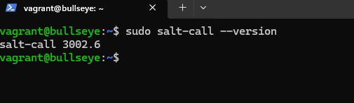

# Viisikko
Ensimmäinen viikkotehtävä alkaa kotioloissa 1.4.2024 noin klo 15:00. Käytössä on taloyhtiön ethernet buustattuna reippaalla nettinopeudella. HostOS:n (isäntäkone) virkaa suorittaa pari vuotta vanha pelikäyttöön tarkoitettu kannettava tietokone, josta löytyy tehoa, tarpeeksi, opiskelu sekä kevyeen pelikäyttöön. Käyttöjärjestelmänä Windows 11 Home.

Viikkotehtävän kulku on tehdä tiivistelmät kolmesta artikkelista. Sen jälkeen siirrytään itse suorittamiseen, jossa ensin asennellaan (tai todennetaan asennus) Salt Windowsille. Tämän jälkeen vuorossa on Vagrantin asennus sekä uuden virtuaalikoneen luonti Vagrantin avulla. Tälle koneelle asennetaan myös Salt, ja annetaan esimerkit viidestä tärkeimmästä tilafunktiosta. Viimeisinä toimina on antaa esimerkki idempotenssista sekä kerätä tietoja tietokoneesta. (Karvinen, T. 2024)

## Tiviistelmät
### Run Salt Command Locally
- Salt:ia käytetään yleensä useiden orja-tietokoneiden hallintaan samanaikaisesti yhdeltä isäntäkoneelta käsin.
- Salt:n keskeisimmät tilafuktiot ovat pkg, file, service, user, cmd.
- Salt:ia voi käyttää paikallisesti testi ja harjoitusmielessä
- (Karvinen, T. 2021)

### Create a Web Page Using Github
- Github on paljolti käytetty, helppo sivusto web-sivun tekemiseen.
- .md muotoinen (markdown) tiedosto tarkoittaa sitä, että Githubiin luotu sivu muunnetaan automaattisesti webbisivuksi.
- web sivua pystyy muokkaamaan otsikoilla, alaotsikoilla, kuvilla,  koodilla yms.
- (Karvinen, T. 2023)

### Raportin kirjoittaminen
- Raportin tulee olla täsmällinen, ja toistettavissa. Toistettavuudella haetaan ajatusta, että samat toiminnot tehdessä raportin lukija päätyisi samaan lopputulokseen.
- Raporttiin on hyvä kirjata työskentely-ympäristö ja työolosuhteet (kotiolot, työpaikka, verkko, HostOS ja GuestOS yms.)
- Raporttiin kirjataan työvaiheet, mitkä on tehtävän aikana suoritettu, sekä niiden ajalliset kulut
- Raportin tulee olla selkeä ja helppolukuinen
- Raportista tulee löytyä lähdeviittaukset, mikäli lähteitä on käytetty
- Plagiointi ei ole missään muodossa sallittua!
- (Karvinen, T. 2006)

## Salt Windowsille - työskentely 1.4.2024 klo 16:55-17:15
Salt:n asennus onnistui jo edellisellä luennolla. Saltin lataus ja wizardin avulla asentaminen tapahtui osoitteesta https://docs.saltproject.io/salt/install-guide/en/latest/topics/downloads.html#windows. Käytän Windowsin PowerShelliä tämän todentamiseen.

- `ls C:\foo.txt` näyttää 27.3.2024 luennolla luodun foo.txt -tiedoston, joka löytyy C  hakemiston "juuresta"
- `salt-call --local grains.item osfinger virtual` näyttää käytössä olevan koneeni käyttöjärjestelmän, sekä selvittää, onko käytössä fyysinen vai virtuaalinen systeemi.

## Vagrantin asennus ja uusi virtuaalikone - Windowsia käyttäen 1.4.2024 17:30-17:55
- https://developer.hashicorp.com/vagrant/install -> Windowsille amd64 lataus. Asennus Wizardia käyttäen
- Asennuksen jälkeen Wizard käskee käynnistämään uudelleen. Testimielessä koitan asentaa uuden virtuaalikoneen Vagrantia käyttäen, ennen boottausta.
- Edit 18:00. Uuden virtuaalikoneen pystyy luomaan ilman HostOS:n uudelleenkäynnistystä
- Vagrantin komennot https://terokarvinen.com/2017/vagrant-revisited-install-boot-new-virtual-machine-in-31-seconds/. Käytännössä nämä komennot ovat samat sekä Linuxilla, että Windowsilla.

- Kuvassa VirtualBox ennen virtuaalikoneen asennusta

- `vagrant init debian/bullseye64` -> Virtuaalikoneen "alustus"
- `vagrant up` -> virtuaalikoneen asennus
- `vagrant ssh` -> ssh yhteyden ottaminen uuteen virtuaalikoneeseen.

- Kuvassa alustus

- Kuvassa ssh yhteys

- Kuvassa uusi Vagrantilla luotu virtuaalikone näkyvissä Virtual Boxissa

## Salt:n asennus Linuxille - uudelle virtuaalikoneelleni
- `sudo apt-get update` -> päivitykset
- `sudo apt-get -y install salt-minion` -> -y vastaa "yes" kaikkiin asennuksessa tuleviin kysymyksiin. Komento lataa salt:n.
- `sudo salt-call --version` -> testi, että asennus toimi

- 

### Lähteet
- Karvinen, T. 2006. Raportin kirjoittaminen. https://terokarvinen.com/2006/06/04/raportin-kirjoittaminen-4/. Luettavissa 1.4.2024
- Karvinen, T. 2017. Vagrant Revisited - Install & Boot New Virtual Machine in 31 Seconds. https://terokarvinen.com/2017/vagrant-revisited-install-boot-new-virtual-machine-in-31-seconds/. Luettavissa 1.4.2024
- Karvinen, T. 2021. Run Salt Commands Locally. https://terokarvinen.com/2021/salt-run-command-locally/. Luettavissa 1.4.2024
- Karvinen, T. 2023. Create a Web Page Using Github. https://terokarvinen.com/2023/create-a-web-page-using-github/. Luetatvissa 1.4.2024
- Karvinen, T. 2024. Tehtävänanto. https://terokarvinen.com/2024/configuration-management-2024-spring/#h1-viisikko. Luettavissa 1.4.2024
- Salt Project. https://docs.saltproject.io/salt/install-guide/en/latest/topics/downloads.html#windows. Luettavissa 1.4.2024
- Vagrant. Asennus. https://developer.hashicorp.com/vagrant/install. Luettavissa 1.4.2024
