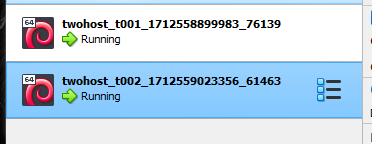
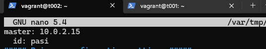

# Soitto Kotiin
Toinen viikkotehtävä alkaa kotosalla 8.4.2024 noin 8:30. Työskentely tapahtuu omalla kannettavalla tietokoneella, joka on kevyeen pelikäyttöön tarkoitettu, ja opiskeluun täysin riittävä. Nettiyhteys on taloyhtiöethernet varustettuna tarpeeksi suurella lisänopeudella.
- Asus Tuf Gaming A15 FA506QM kannettava tietokone
- Käyttöjärjestelmä: Windows 11 Home
- Prosessori: AMD Ryzen 7 5800H, 8 ydintä 3200GHz
- Muisti: 16 Gt
- Näytönohjain 6144Mt omalla muistilla

Viikkotehtävä sisältyy tiivistelmät kolmesta artikkelista. Sen jälkeen siirrytään itse tekemiseen. Ensimmäinen tehtävä on asentaa kaksi virtuaalikonetta samaan verkkoon. Toinen tehtävä on asentaa Saltin herra-orja arkkitehtuuri toimimaan verkon yli. Kolmannessa ajetaan shell-komento orjalla. Neljännessä ajetaan idempotenttikomentoja master-slave yhteyden yli. Sitten keräillään tietoja orjista verkon yli. Viimeisenä kokeillaan vielä infraa koodina. (Karvinen, T. 2024. Tehtävänanto https://terokarvinen.com/2024/configuration-management-2024-spring/#h2-soitto-kotiin)

## x) Tiviistelmät
### Two Machine Virtual Network With Debian 11 Bullseye and Vagrant
- Kertoo Vagrantin käytön helppoudesta
- Antaa ohjeet Vagrantin asennukselle
- Tarjoaa suorat ohjeet, kuinka kaksi Vagrantilla luotua virtuaalikonetta saa samaan aikaan käyttöön
- (Karvinen, T. 2021)

### Salt Quickstart – Salt Stack Master and Slave on Ubuntu Linux
- Artikkeli kertoo master-slave arkkitehtuurista
- Master koneella voi hallita slaveja (orjia) missä tahansa ne ovatkaan
- Artikkelissa ohjeet master ja slave demonien asennukseen
- Artikkelista löytyy komentoja, joilla voi tarkastella master-koneelta orjia
- (Karvinen, T. 2018)

### Hello Salt Infra-as-Code
- Artikkelissa on ohje, kuinka moduuleita luodaan masterilla niin, että ne ovat ajettavissa kaikille orjille
- Moduulit voivat sisältää erilaista saltin omaa koodia, riippuen, mitä halutaa ajettavaksi kaikille orjille
- (Karvinen, T. 2024)

## a) Kahden virtuaalikoneen asentaminen samaan verkkoon (Vagrantilla) 8.4.2024 9:35-10:15
- Ohjeet https://terokarvinen.com/2021/two-machine-virtual-network-with-debian-11-bullseye-and-vagrant/
- Käytän tehtävän tekemiseen Windowsin (HostOS) powershelliä. Loin ensin oman käyttäjäni kotihakemistoon uuden "twohost" kansion komennolla `mkdir twohost`
- twohost kansiossa `vagrant init debian/bullseye64` -> luo vagrant-tiedoston kansioon
- kopion graafisessa käyttöliittymässä ohjeen tekstin (https://terokarvinen.com/2021/two-machine-virtual-network-with-debian-11-bullseye-and-vagrant/) Vagrantfileen
- `vagrant up` -> virtuaalikoneet käyntiin

- Testasin molempien virtuaalikoneiden yhteydet pingaamalla toisensa sekä internettiin
- `vagrant ssh t001` ja `vagrant ssh t002` ssh yhteydet ylös
- `ping -c 1 192.168.88.102` ja `ping -c 1 192.168.88.101` pingaa toisensa (-c 1 taitaa lopettaa pingaamisen yhden vastauksen jälkeen?)
- `ping -c 1 iltalehti.fi` pingaa vielä internetissä olevalle sivustolle.
- Kaikista tuli vastaus
- `exit` komennolla pääsee SSH:sta pois

## b) Herra-orja arkkitehtuuri verkon yli 8.4.2024 10:15-11:20
- Ohjeet https://terokarvinen.com/2018/salt-quickstart-salt-stack-master-and-slave-on-ubuntu-linux/?fromSearch=salt%20quickstart%20salt%20stack%20master%20and%20slave%20on%20ubuntu%20linux
- `vagrant ssh t001` ssh:lla t001 koneeseen sisään. Tästä tulee master
- `sudo apt-get update` päivitykset, jotta asennukset onnistuvat
- `sudo apt-get -y install salt-master` -> asennetaan masteri
- `hostname -I` palauttaa *.*.*.*. Tätä tarvitaan kohta orjan kanssa
- `exit` ssh:sta pois ja Slaven kimppuun
- Tässä kohdassa ymmärsin, että molempia koneita, sekä masteria että minionia tarvitaan tehtävässä, joten avasin toisen powershell-ikkunan jotta sain molemmille ssh-yhteyden samaan aikaan

- `vagrant ssh t002` ssh:lla t002 koneelle. Tästä tulee slave
- `sudo apt-get update` päivitykset
- `sudo apt-get -y install salt-minion` Slave (tai minion) asennus
- `sudoedit /etc/salt/minion` lisätään masterin osoite sekä id tänne, jotta slave voi tunnistaa masterinsa verkossa

- `sudo systemctl restart salt-minion.service` käynnistetään demoni uudelleen, jotta asetukset tulevat voimaan

- Tässä kohdassa tulee ensimmäiset ongelmat. Master-koneen `sudo salt-key -A` ei löydä avaimia hyväksyttäväksi. Kikkailin aikani ja ihmettelin, mistä johtuu. Muutos olikin sitten aika simppeli.

- `hostname -I` antoin molemmissa virtuaalikoneissa, tietenkin, saman osoitteen eli aiemmin mainitun *.*.*.*. Eihän kai minionia voi laittaa osoittamaan itseensä.
- Takaisin minion koneen kimppuun
- `sudoedit /etc/salt/minion` uudelleen. Vaihdoin master osoitteeksi 192.168.88.101, joka oltiin aiemmin luotu Vagrantfileen t001 koneen osoitteeksi.
- Lopputulema antaa saman errorin, vaikka minionin käynnistää uudelleen.
- `sudoedit /etc/salt/minion`. Poistin id-rivin kokonaan. Demonin uudelleen käynnistys

- Master-koneen kimppuun
- `sudo salt-key -A` ja Ta-daa! Nyt on hyväksymättömiä avaimia.

- Testasin vielä toimivuutta masterilla `sudo salt '*' cmd.run 'whoami'` komennolla. Yhteys orjaan toimii

## c) Shell komento orjalla Saltin master-slave yhteyttä käyttäen
Nyt en ole ihan varma, mutta tulikohan tämä b tehtävän viimeisessä tehtyä?

## d)

### Lähteet
- Karvinen, T. 2018. Salt Quickstart – Salt Stack Master and Slave on Ubuntu Linux. https://terokarvinen.com/2018/salt-quickstart-salt-stack-master-and-slave-on-ubuntu-linux/?fromSearch=salt%20quickstart%20salt%20stack%20master%20and%20slave%20on%20ubuntu%20linux. Luettavissa 8.4.2024
- Karvinen, T. 2021. Two Machine Virtual Network With Debian 11 Bullseye and Vagrant. https://terokarvinen.com/2021/two-machine-virtual-network-with-debian-11-bullseye-and-vagrant/. Luettavissa 8.4.2024
- Karvinen, T. 2024. Hello Salt Infra-as-Code. https://terokarvinen.com/2024/hello-salt-infra-as-code/. Luettavissa 8.4.2024
- Karvinen, T. 2024. Tehtävänanto. https://terokarvinen.com/2024/configuration-management-2024-spring/#h2-soitto-kotiin. Luettavissa 8.4.2024
