# Toimiva versio
Kolmas viikkotehtävä, raportin teko alkaa 15.4.2024 klo 16:00. Työskentely tapahtuu omalla kannettavalla tietokoneella, joka on kevyeen pelikäyttöön tarkoitettu, ja opiskeluun täysin riittävä. Nettiyhteys on taloyhtiöethernet varustettuna tarpeeksi suurella lisänopeudella. Raportti sekä tehtävät tulee tehtyä osissa, ja tehtävien tekoajat ovat merkittynä väliotsikoihin.

Viikkotehtävään sisältyy jälleen tiivistelmäosio erinäisistä artikkeleista, jonka jälkeen päästään suorittamaan tehtäviä. A tehtävässä luodaan uusi varasto haluamaamme palveluun (itse käytän githubia). B tehtävässä kloonataan kyseinen varasto itselle, tehdään muutoksia ja lähetetään takaisin. C tehtävässä tehdään jotain todella typerää, tarkoituksellisesti, ja tuhotaan muutokset ennen uploadausta. D tehdävässä tutkitaan lokitietoja. E tehtävässä ajetaan salt-tiloja varastosta. F ja G tehtävät ovat vapaaehtoisia, ja niissä voidaan kokeilla aiempien tehtävien tekemistä toisella käyttöjärjestelmällä, sekä antaa oman varaston kirjoitusoikeudet muillekin! (Karvinen, T. 2024. tehtävänanto)

### HostOS
- Asus Tuf Gaming A15 FA506QM kannettava tietokone
- Käyttöjärjestelmä: Windows 11 Home
- Prosessori: AMD Ryzen 7 5800H, 8 ydintä 3200GHz
- Muisti: 16 Gt
- Näytönohjain 6144Mt omalla muistilla

### GuestOS
- Debian Bookworm, 64-bit
- 4 prosessoriydintä
- 7981 Mt RAM

## x) Tiivistelmät
### Git - Mikä ihmeen Git?
- Git on versionhallintaan tarkoitettu työkalu
- Git toimii ikäänkuin pysäytyskuvina
- Lataa paikalliseksi tiedostoksi, tiedostoja voi muokata vaikka et olisi internetissä. Kun yhteydet taas toimii, voi tiedostot "lähettää eteenpäin"
- Git:n avulla siis ladataan ensin paikallinen kopio esimerkiksi tiedostosta. Sitten sitä voi muokata paikallisesti. Kun muokkaus on valmis, sen voi tallentaa niin, että se tulee uusimpaan versioon.
- Git:llä voi palata aina aiempiinkin versioihin, mitä on tallennettu
- (Chacon and Straub. 2014)

### Git:n käyttö - `git add . && git commit; git pull && git push`
- `git add` tällä komennolla annetaan impulssi, että nyt on menossa "vaiheistus", stage. Tämä on välttämätöntä tehdä, jotta Git ymmärtää muutosten olevan tulossa
- `git commit` tällä komennolla tallennetaan muutokset
- `git push` tällä komennolla lähetetään paikallisesti tallennettu tiedosto eteenpäin. Siis käytännössä "upload"
- `git pull` tällä komennolla haetaan viimeisin kansio, projekti, "repo", paikalliseksi tiedostoksi
- (Kholiya, P. 2018)

### Varaston terokarvinen/suolax/ historia
- Kauheasti Commiteja
- Uusia versioita useampi, joissa on kerrottu kommentilla, mitä on tehty
- (Karvinen, T. Saltx. 2024)

## a) Online 15.4.2024 21:45-21:50
Suoritan tehtävän Githubia käyttäen. Klikkaan oman dashboardini oikeassa yläkulmassa olevaa plus-nappia, ja klikkaan "new repository". Tämän jälkeen keksin repolle nimen, kuvauksen sekä asetan sen julkiseksi.

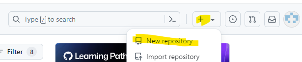

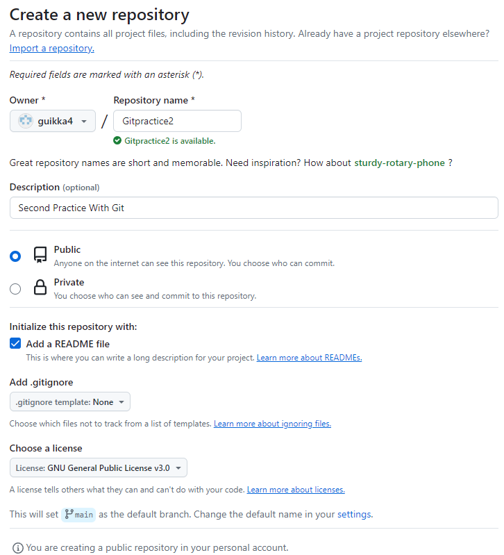

## b) Dolly 15.4.2024 21:55-22:42 . Tässä tehtävässä käytän GuestOS konetta VirtualBoxin kautta.
- Aloitetaan menemällä Githubiin ja haetaan SSH koodi (SSH avain on lisätty aiemmin Githubiin)

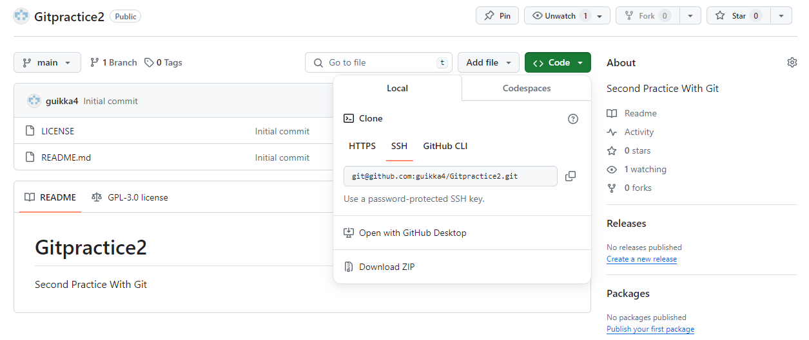

- `git clone git@github.com:guikka4/Gitpractice2.git` -> komentoriville

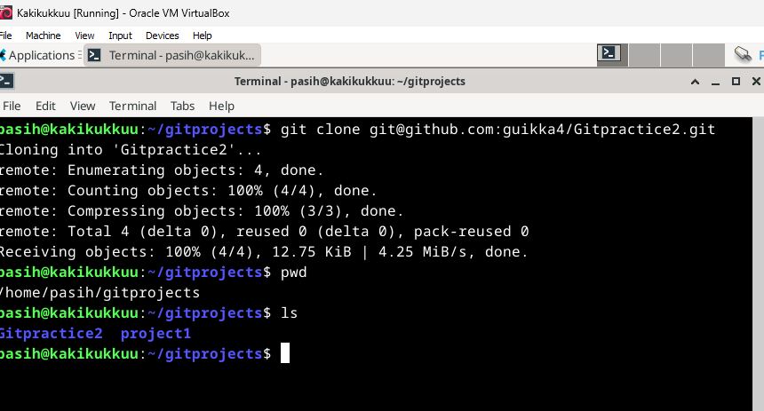

- Tässä kohtaa huomaan, että tehtävänanto käskee antamaan sanan "summer" sekä varaston nimeen että kuvaukseen. Ja ei kun alusta. (https://terokarvinen.com/2024/configuration-management-2024-spring/#h3-toimiva-versio)
- Laitetaan nettiin tieto, että tämä on testi vaan
- `micro README.md` - kirjoitellaan tämä testitieto sinne

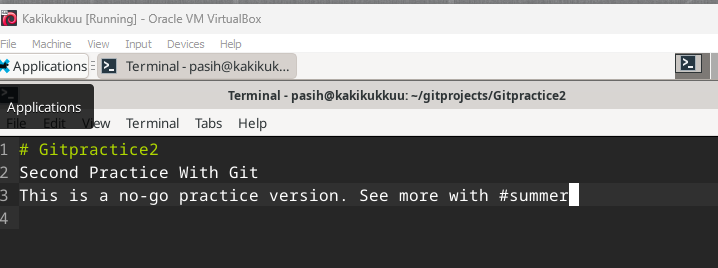

- `git add .` `git commit` jälkeen "kommentti, mitä on tehty" `git pull` `git push`

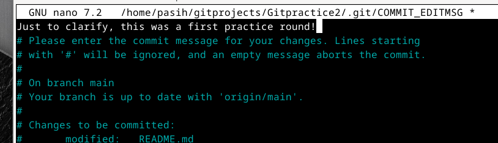

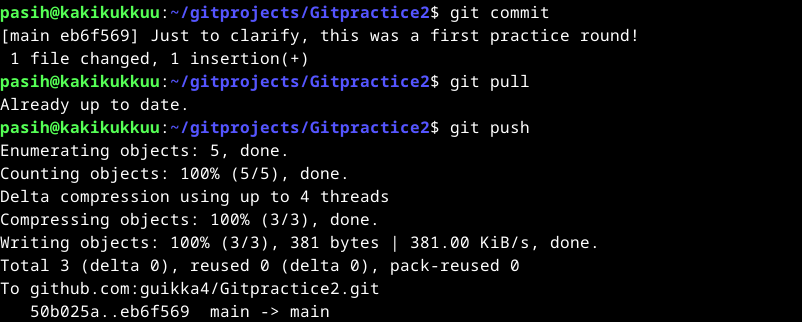

Mennään uudelleen Githubiib, ja tehdään uudelleen samat toimenpiteet.

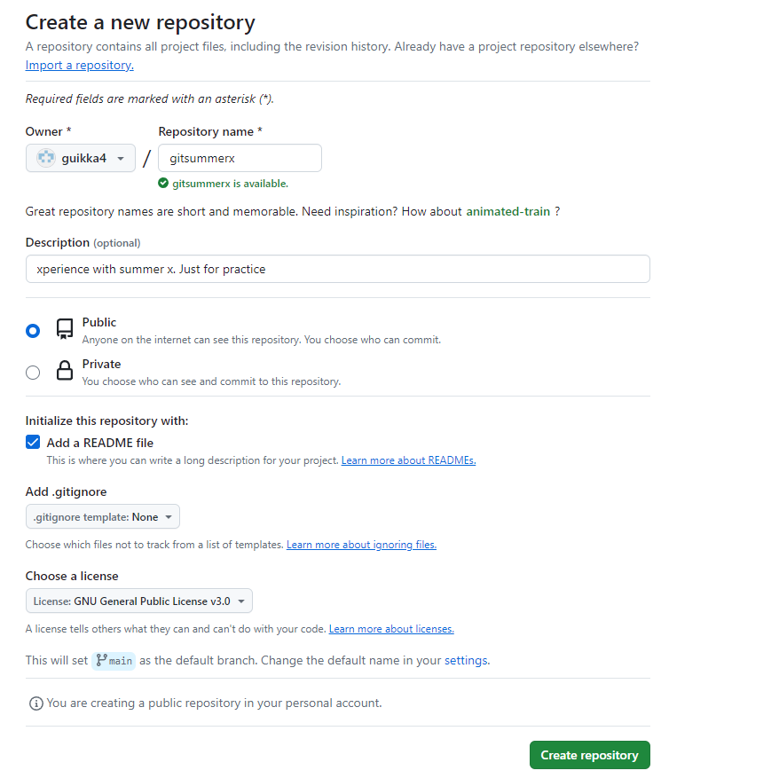

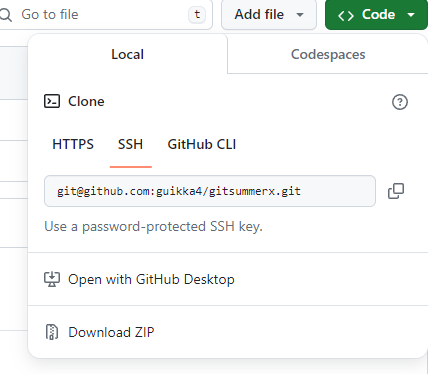

     git clone git@github.com:guikka4/gitsummerx.git

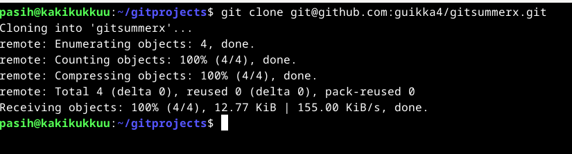

Noniin, nyt kun tässä vaiheessa ollaan kuosissa, on aika jättää jälki tähän kloonirepoon, ja uploadata se.

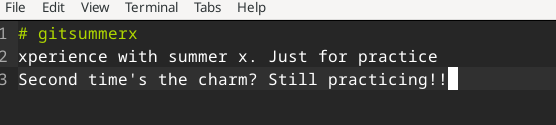

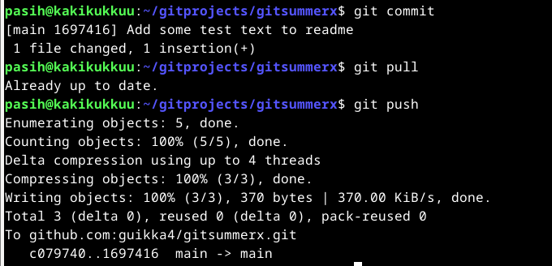

 Lopputuotos on kaksi kuvakaappausta, ennen ja jälkeen. Ennen lopputuotosta oli komennot kaappauksina.

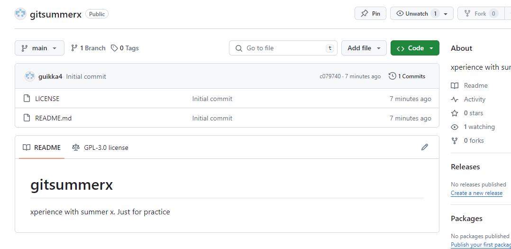

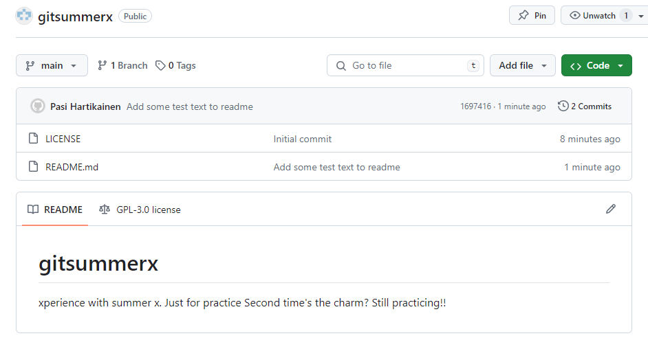

## Lähteet
- Chacon & Straub. 2014. What is Git? https://git-scm.com/book/en/v2/Getting-Started-What-is-Git%3F. Luettavissa 15.4.2024
- Karvinen, T. 2024. Saltx. https://github.com/terokarvinen/suolax/commits/main/. Luettavissa 15.4.2024
- Karvinen, T. 2024. Tehtävänanto. https://terokarvinen.com/2024/configuration-management-2024-spring/#h3-toimiva-versio. Luettavissa 15.4.2024
- Kholiya, P. 2018. https://medium.com/@itsmepankaj/git-workflow-add-commit-push-pull-69adf44cf812. Luettavissa 15.4.2024

